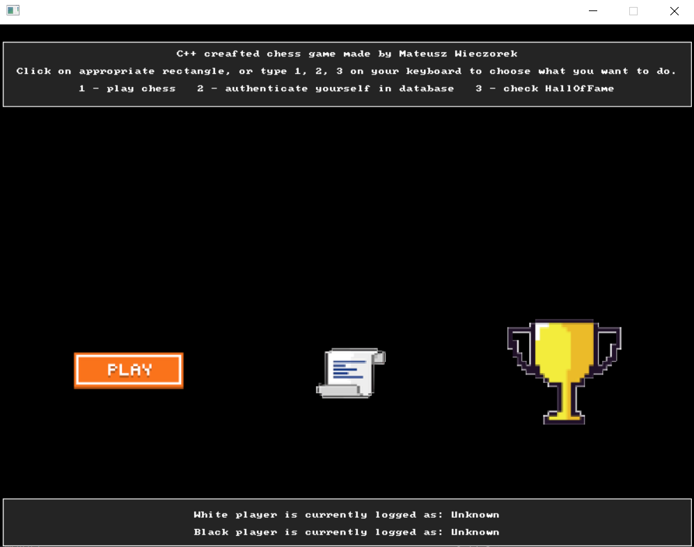
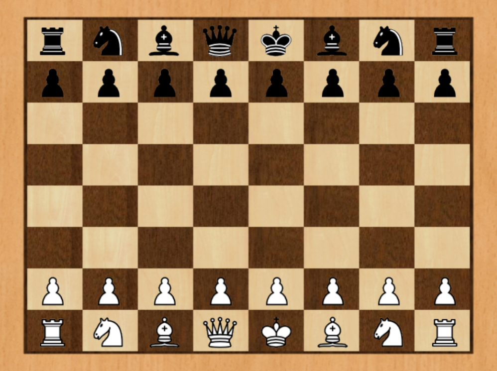

# Chess Game in C++


## 🛠️ How to Run This Project

Make sure the following paths and dependencies are correctly set in **Visual Studio Project Properties**:

### 🔹 C/C++ → General → Additional Include Directories:
```
$(SolutionDir)\include
```

### 🔹 Linker → General → Additional Library Directories:
```
$(SolutionDir)\lib\x64
```

### 🔹 Linker → Input → Additional Dependencies:
```
SDL2.lib
SDL2main.lib
SDL2_image.lib
SDL2_mixer.lib
```


## Overview

This is a C++ chess game, meticulously crafted using Object-Oriented Programming (OOP) principles. The implementation includes a variety of features such as every possible chess move, castling on both sides and En Passant. You also have sound effects for different moves. One for moving piece into empty square and one for pieces that go to non empty square.

## Screenshots

*Start page*


*Game*


## Interface

Choose from three options to interact with the chess game:

1. **Quick Start:** Initiate a chess game with currently logged players. If a player is not logged in, their name will be displayed as "Unknown".

2. **Player Authentication:** Authenticate in the player database by providing pieces color you want to play with and your name. If your name is new, you will be added to the database. If your name already exists, you can specify whether you want to play as white or black.

3. **Hall of Fame:** Explore the Hall of Fame to view metrics of the top 6 players. Compete with your friends to climb the rankings and establish yourself among the chess elite!


## Chess Moves

- **Comprehensive Moves:** Every standard chess move is implemented, allowing players to enjoy a complete and authentic gaming experience.

- **Castling**.

- **En Passant**.

- **Promotion**.

This chess game project utilizes SDL2, SDL2_image, SDL2_mixer libraries.

## Prerequisites

Downloads for SDL2, SDL_image, SDL_mixer:
- [SDL2 Releases](https://github.com/libsdl-org/SDL/releases/tag/release-2.28.5)
- [SDL_image Releases](https://github.com/libsdl-org/SDL_image/releases)
- [SDL_mixer Releases](https://github.com/libsdl-org/SDL_mixer/releases)

Happy gaming!
